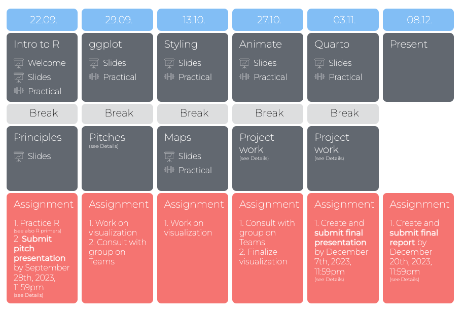
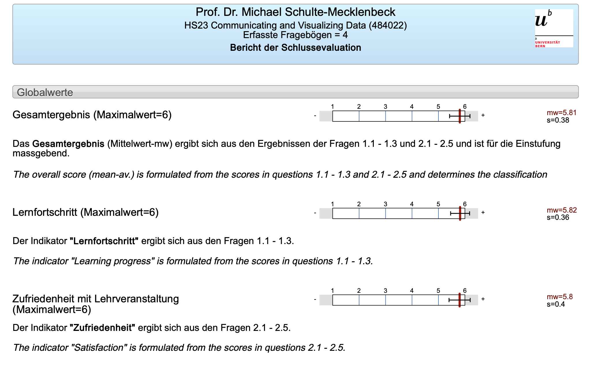
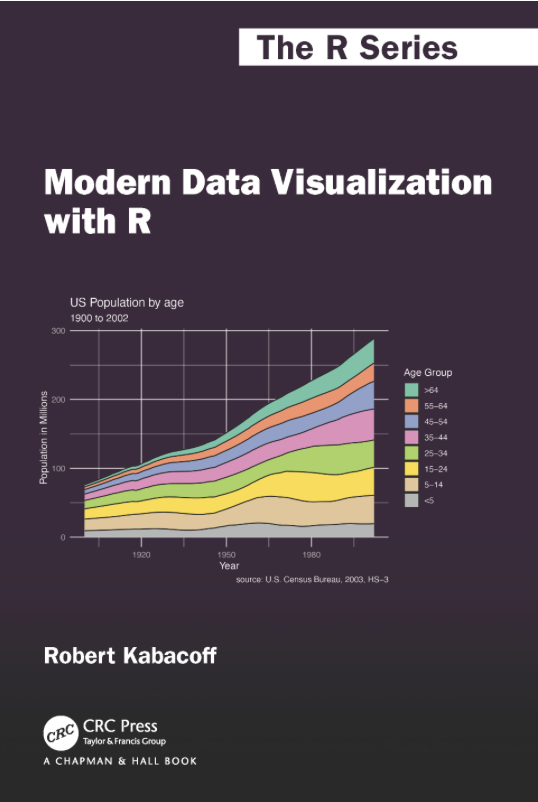

---
```{r setup, include=FALSE}
options(htmltools.dir.version = FALSE)
options(width=110)
options(digits = 4)

knitr::opts_chunk$set(fig.align = 'center')
```

.pull-left6[

<br><br><br><br><br>


# Goal

>### The goal of this workshop is to introduce you to R's tools for data visualization and communication and how they can be used to effectively communicate insights from data!

]

.pull-right4[

<br><br><br><br>
<p align="center"></p>

]


---

.pull-left45[

<br>
# Schedule 

<ul>
  <li class="m1"><span>Class consists of 6 sessions on R. Each session is structured into:</span></li>
  <ul class="level">
    <li><span>Recap</high></span></li> 
    <li><span>Introduction to new topic(s)</high></span></li> 
    <li><span>Coding exercises</span></li>
    <li><span>Project work</span></li>
    <li><span>Q&A</span></li> 
  </ul>
  <li class="m2"><span>There are specific assignments (pitch, presentation, report) between sessions. You are also expected to finish up practicals if you don't finish within one session. </span></li>
</ul>

]

.pull-right5[
<br><br><br><br><br>


]

---

.pull-left45[

<br>
# Evaluation results

<ul>
  <li class="m1"><span>Details on Teams!</span></li>
</ul>

]

.pull-right5[
<br><br><br><br><br>


]

---

.pull-left45[

# Rating presentations

<ul>
  <li class="m1"><span>Visual appeal</span></li>
  <li class="m2"><span>Technical sophistication</span></li>
  <li class="m3"><span>Information value</span></li>
  
  <li class="m4"><span>Overall mark</span></li>
</ul>


]

.pull-right5[
<iframe src="https://docs.google.com/forms/d/e/1FAIpQLSdBbcAnxZsBTdNf0uH4Rf5n-70bCpWV2EGk-swOiasZsWwduA/viewform?embedded=true" width="640" height="1056" frameborder="0" marginheight="0" marginwidth="0">Loading…</iframe>

]

---
.pull-left45[
# What now?

<ul>
  <li class="m1"><span>Books (e.g., Kabacoff)</span></li>
  <li class="m2"><span>Webpages (e.g., Posit)</span></li>
  <li class="m3"><span>Social Media (e.g., BlueSky)</span></li>
  <li class="m4"><span><high>Practise!!</high></span></li>
</ul>


]

.pull-right5[
<a href = 'https://rkabacoff.github.io/datavis/'>

</a>


]

---

class: middle, center


---

class: middle, center

<h1>Thanks!</h1>


