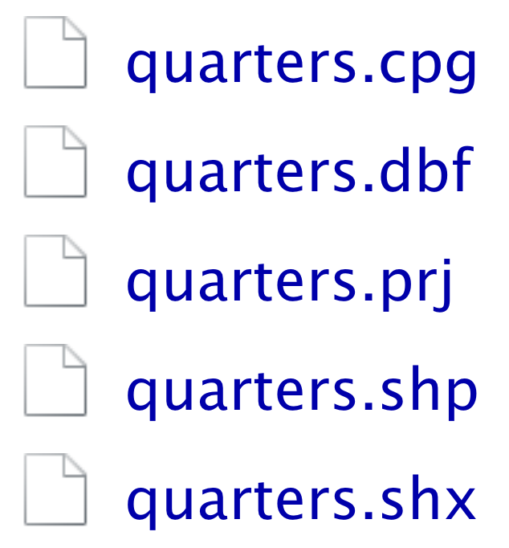

```{r setup, include=FALSE}
options(htmltools.dir.version = FALSE)
# see: https://github.com/yihui/xaringan
# install.packages("xaringan")
# see: 
# https://github.com/yihui/xaringan/wiki
# https://github.com/gnab/remark/wiki/Markdown
options(width=110)
options(digits = 4)
```

```{r, echo = FALSE ,message = FALSE, warning = FALSE}
knitr::opts_chunk$set(comment=NA, fig.width=6, fig.height=6, echo = TRUE, eval = TRUE, 
                      message = FALSE, warning = FALSE, fig.align = 'center', dpi = 200)
library(tidyverse)
library(ggthemes)
library(sf)
require(tidygraph)
require(ggraph)
basel = read_csv('1_Data/taxation.csv')
basel_map = sf::read_sf('1_Data/quarters')

```


.pull-left3[

# Maps with <mono>ggplot</mono>/<mono>sf</mono>

<ul>
  <li class="m1"><span>Maps require geometric shapes stored in <high>shapefiles</high>.</span></li><br>
  <li class="m2"><span>The <high>simple features</high> (<mono>sf</mono>) framework makes processing and visualizing maps with the <mono>tidyverse<mono> easy.</span></li>
</ul>

]


.pull-right6[

<br><br>

```{r, echo = FALSE, fig.width = 5, fig.height = 4, dpi=250, fig.align='center'}
basel_map %>% 
  left_join(basel %>% filter(year == 2017), by = c("TYPE" = "quarter")) %>% 
  ggplot() + 
  geom_sf(mapping=aes(fill = income_mean), col = 'white') + 
 theme_void() + 
  labs(title = "Inequality in Basel",
       subtitle = "Average income in Basel's quarters in 2017",
       caption = "Source: Open Data Basel Stadt") + 
  scale_fill_continuous(name = 'Income') 
```

]

---

# Shapefiles

.pull-left45[

<ul>
  <li class="m1"><span>Geospatial vector data format for <high>geographic information system</high> (GIS) software.</span></li><br>
  <li class="m2"><span>Necessary files:</span></li>
  <ul class="level">
    <li><span><mono>.shp</mono> | actual shapefile</span></li>
    <li><span><mono>.shx</mono> | shape index format</span></li>
    <li><span><mono>.dbf</mono> | attribute format</span></li>
  </ul><br>
  <li class="m3"><span>Optional files:</span></li>
  <ul class="level">
    <li><span><mono>.prj</mono> | projection description</span></li>
    <li><span><mono>.cpg</mono> | code page specification</span></li>
  </ul>
</ul>

]


.pull-right45[
<p align="center">

</p>
]


---

# <mono>sf</mono>


```{r, echo = F, message=F}
require(tibble)
options(tibble.width = 100, tibble.max_extra_cols = 6, tibble.print_max = 10)
```


```{r, echo = TRUE, fig.width = 5, fig.height = 4, dpi=250}
read_sf('1_Data/quarters') 
```


---

# <mono>geom_sf</mono>

.pull-left45[

<ul>
  <li class="m1"><span>Since <mono>read_sf</mono> creates a <mono>tibble</tibble>, it can be plugged <high>straight into <mono>ggplot</mono></high>.</span></li><br>
  <li class="m2"><span>The dedicated geom <mono>geom_sf</mono> plots the geometric polygons.</span></li>
</ul>

<br>

```{r, eval = F, fig.width = 5, fig.height = 4, dpi=250}
# read shapefiles
quarters_map <- read_sf('1_Data/quarters')

# plot quarters
quarters_map %>% 
  ggplot() +
  geom_sf()
   
```

]

.pull-right45[

```{r, echo = FALSE, fig.width = 5, fig.height = 4, dpi=250, fig.align='center'}
# read shapefiles
quarters_map <- read_sf('1_Data/quarters')


quarters_map %>% 
  ggplot() +
  geom_sf()
```

]


---

# <mono>geom_sf</mono>

.pull-left45[

<ul>
  <li class="m1"><span>Since <mono>read_sf</mono> creates a <mono>tibble</tibble>, it can be plugged <high>straight into <mono>ggplot</mono></high>.</span></li><br>
  <li class="m2"><span>The dedicated geom <mono>geom_sf</mono> plots the geometric polygons.</span></li>
</ul>

<br>

```{r, eval = F, fig.width = 5, fig.height = 4, dpi=250}
# read shapefiles
quarters_map <- read_sf('1_Data/quarters')

# plot quarters
quarters_map %>% 
  ggplot() +
  geom_sf() + 
  
  # remove background
  theme_void()
   
```

]

.pull-right45[

```{r, echo = FALSE, fig.width = 5, fig.height = 4, dpi=250, fig.align='center'}
quarters_map <- read_sf('1_Data/quarters')

quarters_map %>% 
  ggplot() +
  geom_sf() + 
  theme_void()
```

]


---

# Wrangling

.pull-left45[

<ul>
  <li class="m1"><span>Since <mono>read_sf</mono> creates a <mono>tibble</tibble>, one can easily <high>join additional data</high>.</span></li>
</ul>

<br>

```{r, eval = F, fig.width = 5, fig.height = 4, dpi=250}
# join basel tax data
quarters_map <- quarters_map %>% 
  left_join(filter(basel, year == 2017), 
            by = c("TYPE" = "quarter"))

# plot quarters
quarters_map %>% 
  ggplot() +
  geom_sf() + 
  theme_void()
```

]

.pull-right45[

```{r, echo = FALSE, fig.width = 5, fig.height = 4, dpi=250, fig.align='center'}
quarters_map <- read_sf('1_Data/quarters') %>% 
  left_join(filter(basel, year == 2017), 
            by = c("TYPE" = "quarter"))


quarters_map %>% 
  ggplot() +
  geom_sf() + 
  theme_void()
```

]

---

# Add color

.pull-left45[

<ul>
  <li class="m1"><span>Colors are set using <mono>aes()</mono> just like in a regular <mono>ggplot</mono>.</span></li>
</ul>

```{r, eval = F, fig.width = 5, fig.height = 4, dpi=250}
# join basel tax data
quarters_map <- quarters_map %>% 
  left_join(filter(basel, year == 2017), 
            by = c("TYPE" = "quarter"))

# plot quarters
quarters_map %>% 
  ggplot() +
  
  # fill color by income
  geom_sf(aes(fill = income_mean)) + 
  theme_void()
```

]

.pull-right45[

```{r, echo = FALSE, fig.width = 5, fig.height = 4, dpi=250, fig.align='center'}
quarters_map <- read_sf('1_Data/quarters') %>% 
  left_join(filter(basel, year == 2017), 
            by = c("TYPE" = "quarter"))

quarters_map %>% 
  ggplot() +
  geom_sf(aes(fill = income_mean)) + 
  theme_void()
```

]

---

# Styling

.pull-left45[

<ul>
  <li class="m1"><span>Styling can be adjusted just like in any other <mono>ggplot<mono>.</span></li>
</ul>

```{r, eval = F, fig.width = 5, fig.height = 4, dpi=250}
# join basel tax data
quarters_map <- quarters_map %>% 
  left_join(filter(basel, year == 2017), 
            by = c("TYPE" = "quarter"))

# plot quarters
quarters_map %>% 
  ggplot() +
  
  # add white outlines
  geom_sf(aes(fill = income_mean),
              col = "white") + 
  theme_void()
```

]

.pull-right45[

```{r, echo = FALSE, fig.width = 5, fig.height = 4, dpi=250, fig.align='center'}
quarters_map <- read_sf('1_Data/quarters') %>% 
  left_join(filter(basel, year == 2017), 
            by = c("TYPE" = "quarter"))
# plot quarters
quarters_map %>% 
  ggplot() +
  geom_sf(aes(fill = income_mean),
              col = "white") + 
  theme_void()
```

]


---

# Styling

.pull-left45[

<ul>
  <li class="m1"><span>Styling can be adjusted just like in any other <mono>ggplot<mono>.</span></li>
</ul>

```{r, eval = F, fig.width = 5, fig.height = 4, dpi=250}
# join basel tax data
quarters_map <- quarters_map %>% 
  left_join(filter(basel, year == 2017), 
            by = c("TYPE" = "quarter"))

# plot quarters
quarters_map %>% 
  ggplot() +
  geom_sf(aes(fill = income_mean),
              col = "white") + 
  theme_void() + 
  
  # change legend title
  scale_fill_continuous(name = 'Income') 
```

]

.pull-right45[

```{r, echo = FALSE, fig.width = 5, fig.height = 4, dpi=250, fig.align='center'}
quarters_map <- read_sf('1_Data/quarters') %>% 
  left_join(filter(basel, year == 2017), 
            by = c("TYPE" = "quarter"))

quarters_map %>% 
  ggplot() +
  geom_sf(aes(fill = income_mean),
              col = "white") + 
  theme_void() + 
  scale_fill_continuous(name = 'Income') 
```

]

---

# Styling

.pull-left45[

<ul>
  <li class="m1"><span>Styling can be adjusted just like in any other <mono>ggplot<mono>.</span></li>
</ul>

```{r, eval = F, fig.width = 5, fig.height = 4, dpi=250}
# join basel tax data
quarters_map <- quarters_map %>% 
  left_join(filter(basel, year == 2017), 
            by = c("TYPE" = "quarter"))

# plot quarters
quarters_map %>% 
  ggplot() +
  geom_sf(aes(fill = income_mean),
              col = "white") + 
  theme_void() + 
  scale_fill_continuous(name = 'Income') +
  
  # add annotion
  labs(title = "Inequality in Basel",
     subtitle = "Average income in Basel...",
     caption = "ource: Open Data Basel...")
```

]

.pull-right45[

```{r, echo = FALSE, fig.width = 5, fig.height = 4, dpi=250, fig.align='center'}
quarters_map <- read_sf('1_Data/quarters') %>% 
  left_join(filter(basel, year == 2017), 
            by = c("TYPE" = "quarter"))

quarters_map %>% 
  ggplot() +
  geom_sf(aes(fill = income_mean),
              col = "white") + 
  theme_void() + 
  scale_fill_continuous(name = 'Income') +
  labs(title = "Inequality in Basel",
     subtitle = "Average income in Basel's quarters in 2017",
     caption = "Source: Open Data Basel Stadt")
```

]


---

# <mono>geom_label()</mono>

.pull-left45[

<ul>
  <li class="m1"><span>Annotation with labels or images requires specification of a location such as the <high>polygon's centroid</high>.</span></li>
</ul>

```{r, eval = F, fig.width = 5, fig.height = 4, dpi=250}
# start with joint object
quarters_map %>% 
  
  # determine centroids
  mutate(ctr = st_centroid(geometry),
    lon = sapply(ctr, function(x) x[1]),
    lat = sapply(ctr, function(x) x[2])) %>% 

  # plot quarters
  ggplot(...) +
    
  # add labels
  geom_label_repel(aes(x = lon, 
                       y = lat, 
                       label = TYPE), 
                   size = 2.5)
```

]

.pull-right45[

```{r, echo = FALSE, fig.width = 5, fig.height = 4, dpi=250, fig.align='center'}
require(ggrepel)

quarters_map %>% 
  
  # determine centroids
  mutate(ctr = st_centroid(geometry),
        lon = sapply(ctr, function(x) x[1]),
        lat = sapply(ctr, function(x) x[2])) %>% 
  ggplot() +
  geom_sf(aes(fill = income_mean),
          col = "white") + 
  theme_void() + 
  scale_fill_continuous(name = 'Income') +
  labs(title = "Inequality in Basel",
       subtitle = "Average income in Basel's quarters in 2017",
       caption = "Source: Open Data Basel Stadt") +
  geom_label_repel(aes(x = lon, y = lat, label = TYPE), size=2.5)
```

]


---

# <mono>geom_image()</mono>

.pull-left45[

<ul>
  <li class="m1"><span>Styling can be adjusted just like in any other <mono>ggplot<mono>.</span></li>
</ul>

```{r, eval = F, fig.width = 5, fig.height = 4, dpi=250}
# join basel tax data
quarters_map %>% 
  
  # determine centroids
  mutate(ctr = st_centroid(geometry),
    lon = sapply(ctr, function(x) x[1]),
    lat = sapply(ctr, function(x) x[2])) %>% 

  # plot quarters
  ggplot(...) +
    
  # add images
  geom_image(aes(x = lon, y = lat, 
                 image = image), 
             size=.05)
```

]

.pull-right45[

```{r, echo = FALSE, fig.width = 5, fig.height = 4, dpi=250, fig.align='center'}
require(ggimage)
quarters_map <- read_sf('1_Data/quarters') %>% 
  left_join(filter(basel, year == 2017), 
            by = c("TYPE" = "quarter")) %>% 
  mutate(centroid_lon = sapply(st_centroid(geometry), function(x) x[1]),
         centroid_lat = sapply(st_centroid(geometry), function(x) x[2]),
         image = case_when(
           income_mean >= 40000 & income_mean < 60000 ~ "1_Data/coins/40k.png",
           income_mean >= 60000 & income_mean < 80000 ~ "1_Data/coins/60k.png",
           income_mean >= 80000 & income_mean < 100000 ~ "1_Data/coins/80k.png",
           income_mean >= 100000 & income_mean < 120000 ~ "1_Data/coins/100k.png",
           income_mean > 120000 ~ "1_Data/coins/120k.png",
         ),
         centroid_lat_offset = case_when(
           income_mean < 50000 ~ centroid_lat + 140,
           income_mean >= 50000 & income_mean < 65000 ~ centroid_lat + 160,
           income_mean >= 65000 & income_mean < 80000 ~ centroid_lat + 180,
           income_mean >= 80000 & income_mean < 100000 ~ centroid_lat + 200,
           income_mean > 100000 ~ centroid_lat + 220,
         ))

quarters_map %>% 
  ggplot() +
  geom_sf(aes(fill = income_mean),
          col = "white") + 
  theme_void() + 
  scale_fill_continuous(name = 'Income') +
  labs(title = "Inequality in Basel",
       subtitle = "Average income in Basel's quarters in 2017",
       caption = "Source: Open Data Basel Stadt") +
  geom_image(aes(x=centroid_lon, y = centroid_lat_offset, image = image), 
             size=.05)
```

]

---

class: middle, center

<h1><a href="https://michaelschulte.github.io/CaVD_HS2023/">Schedule</a></h1>


