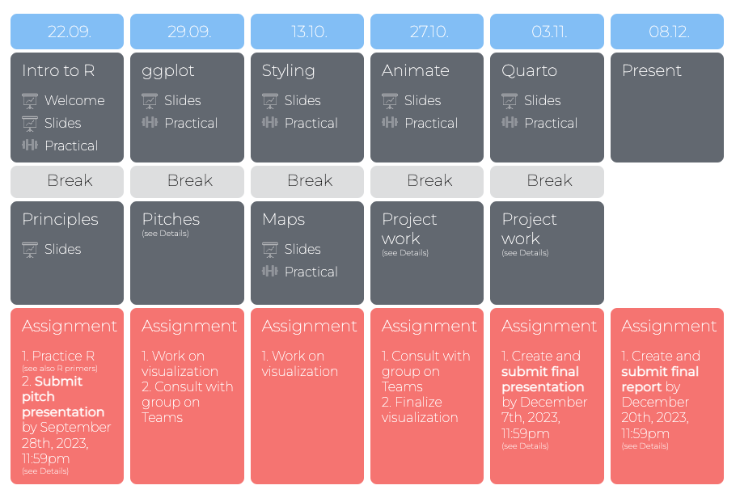
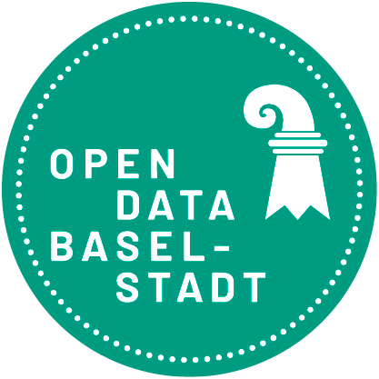
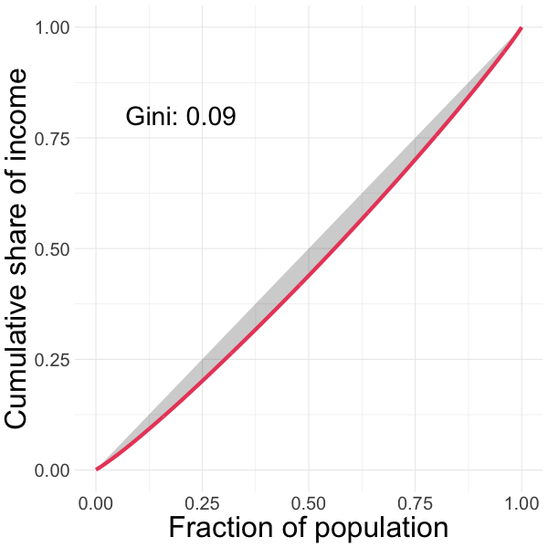
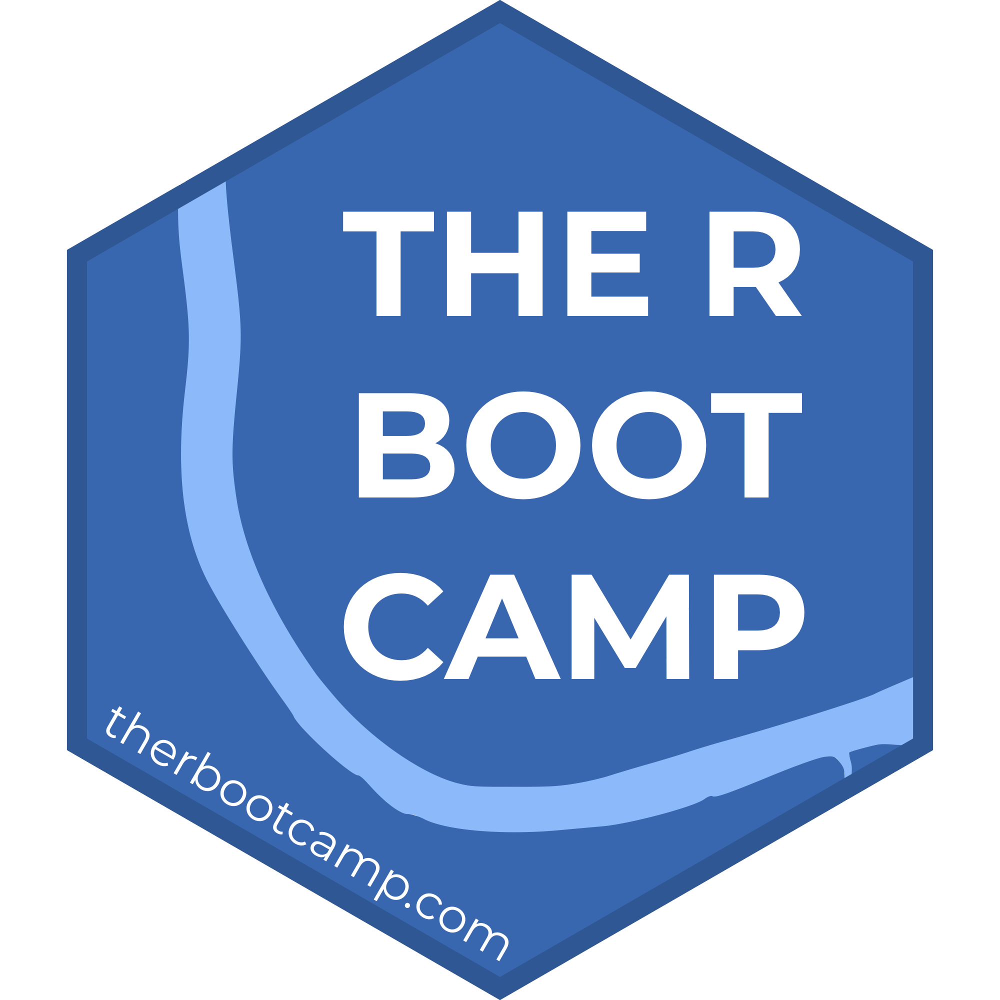

---
```{r setup, include=FALSE}
options(htmltools.dir.version = FALSE)
options(width=110)
options(digits = 4)

knitr::opts_chunk$set(fig.align = 'center')
```

<!---

.pull-left45[
<br><br><br><br><br>
# Materialien

Klicke auf <high>"....running..."</high> auf unserer Website!

<font style="font-size:28px"><a href="www.therbootcamp.com"><b>www.therbootcamp.com</b></a></font>

]

.pull-right5[

<br><br>
<iframe src="https://therbootcamp.github.io" width="500" height="500"></iframe>

]

--->

.pull-left6[

<br><br><br><br><br>


# Goal


>### The goal of this workshop is to introduce you to R's tools for data visualization and communication and how they can be used to effectively communicate insights from data!

]

.pull-right4[

<br><br><br><br>
<p align="center"></p>

]


---

.pull-left45[

<br>
# Schedule 

<ul>
  <li class="m1"><span>Class consists of 6 sessions on R. Each session is structured into:</span></li>
  <ul class="level">
    <li><span>Recap</high></span></li> 
    <li><span>Introduction to new topic(s)</high></span></li> 
    <li><span>Coding exercises</span></li>
    <li><span>Project work</span></li>
    <li><span>Q&A</span></li> 
  </ul>
  <li class="m2"><span>There are specific assignments (pitch, presentation, report) between sessions. You are also expected to finish up practicals if you don't finish within one session. </span></li>
</ul>

]

.pull-right5[
<br><br><br>


]

---

.pull-left3[

# Inequality in Basel

<font style="font-size:28px"><high><i class="far fa-question-circle"></i></high> How has the distribution of income and wealth changed within and between Basel's quarters from 2001 and 2017?</i></font>

<br>

<p align="center">

</p>

]

.pull-right6[

<br>

<p align="center">

</p>

]

---

.pull-left3[

# Inequality in Basel

<font style="font-size:28px"><high><i class="far fa-question-circle"></i></high> How has the distribution of income and wealth changed within and between Basel's quarters from 2001 and 2017?</i></font>

<br>

<p align="center">

</p>

]

.pull-right6[

<br>

<p align="center">

</p>

]


---

.pull-left3[

# Mean, Median, Gini

<ul>
  <li class="m1"><span>Inequality arising from a <high>rich-get-richer</high> dynamic materializes as an increasingly right-skewed income distribution.</span></li><br>
  <li class="m2"><span>This can be detected:</span></li><br>
  <ul class="level">
    <li><span><high>Mean</high> income grows faster than <high>median</high> income.</span></li><br>
    <li><span>The <high>Gini</high> coefficient goes up.</span></li>
  </ul>
</ul>

]


.pull-right65[
<br>
<p align="center">
<br>

</p>
]

---

.pull-left3[

# Mean, Median, Gini

<ul>
  <li class="m1"><span>Inequality arising from a <high>rich-get-richer</high> dynamic materializes as an increasingly right-skewed income distribution.</span></li><br>
  <li class="m2"><span>This can be detected:</span></li><br>
  <ul class="level">
    <li><span><high>Mean</high> income grows faster than <high>median</high> income.</span></li><br>
    <li><span>The <high>Gini</high> coefficient goes up.</span></li>
  </ul>
</ul>

]


.pull-right65[
<br>
<p align="center">
<br>

</p>
]


---

# Who am I?

<table class="tg"  style="cellspacing:0; cellpadding:0; border:none">
  <col width="40%">
  <col width="40%">
  <tr>
 
  
  <th class="tg-yw4l" valign='top'>
    <p align="center">
    <a href="https://www.schulte-mecklenbeck.com/"></a><br>
    <p align="center">
    <font size = 5>Prof. Dr. Michael<br>Schulte-Mecklenbeck</font><br><br>
    <a href="www.schulte-mecklenbeck.com"><b>schulte-mecklenbeck.com</b></a><br>
    <a href="https://github.com/schultem"><b>github.com/schultem</b></a><br><br>
    </p>
  </th>
  
  <th class="tg-yw4l" valign='top'>
    <p align="center">
    <a href="https://therbootcamp.github.io/"></a><br>
    <p align="center">
    <font size = 5>The R Bootcamp</font><br><br><br>
    <a href="https://therbootcamp.github.io/"><b>therbootcamp.github.io</b></a><br>
    </p>
  </th>


</tr>

</table>


---

# Who you are?

.pull-left35[

<ul>
  <li class="m1"><span>What is your name?</span></li><br>
  <li class="m2"><span>Where are you from?</span></li><br>
  <li class="m3"><span>Main study topic?</span></li><br>
  <li class="m4"><span>How much experience do you have with R?</span></li><br>
  <li class="m5"><span>What is your goal behind wanting to learn data visualization with R?</span></li>
</ul>

]

.pull-right55[

<p align="center">

<br>
<font style="font-size:10px">from <a href="https://unsplash.com/photos/3MYvgsH1uK0">unsplash.com</a></font>
</p>

]

---

class: middle, center

<h1><a href="https://www.dropbox.com/s/siwk0mqzr3dofc5/TheRBootcamp.zip?dl=1">Download<br>project</a></h1>


---

class: middle, center

<h1><a href="https://michaelschulte.github.io/CaVD_HS2023/">Schedule</a></h1>


